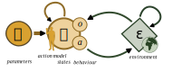
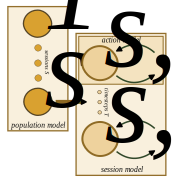

# Computational cognitive modelling

Computational modelling of cognition and behaviour - or cognitive modelling for short - is a standard method in fields like mathematical psychology (Coombs, Dawes, & Tversky, 1970), computational psychiatry (Montague, Dolan, Friston, & Dayan, 2012) and model-based neuroscience (Palmeri, Love, & Turner, 2017).
The method consists of making formal and computational models of the unobservable mental processes that underlie observable behaviour, in the same way computational models are made of other unobservable phenomena in the natural sciences.

The aim of cognitive modelling is to provide mechanistic and formal accounts of mental processes. These can be used to test how well theories of cognitive function can describe empirically observed behaviour, and they can be used to make inference about individual differences in cognitive processes, for example between clinical populations.

Broadly speaking, cognitive models can be used in one of two ways. In theoretical cognitive modelling, cognitive processes and resulting behaviour are simulated in various environments and under various conditions, or extended with formal proofs, in order to explore the implications of various cognitive models. In applied cognitive modelling, models are applied to empirical behavioural data (from human, animals, organoids or other real or simulated behavioural systems), in order to make inference about the processes that generated that behaviour.

Since both the fields of cognitive modelling and machine learning are in the business of designing computational models that generate behaviour, cognitive models can inspire as well as be inspired by more engineering-oriented models in machine learning fields, and questions, topics, methods and sometimes concrete models often overlap between the two fields. The primary difference is perhaps that machine learning to a higher degree requires computational and performance efficiency, while cognitive modelling require interpretability and theoretical plausibility as models of cognitive mechanisms.

There are various modelling approaches or paradigms within cognitive modelling, implying different theoretical commitments and used by different scientific communities. Some noteworthy paradigms might include cognitive architecture models (Ritter, Tehranchi, & Oury, 2019), Bayesian mind models (Griffiths, Chater, & Tenenbaum, 2024), variational Bayesian predictive processing models like active inference (Parr, Pezzulo, & Friston, 2022) and hierarchical gaussian filters (Mathys et al., 2014), reinforcement learning models (Dayan & Balleine, 2002), sequential sampling models (Forstmann, Ratcliff, & Wagenmakers, 2016) and connectionist (Houghton, 2004) and deep learning models (Wang et al., 2016). There is also a range of models, often classic models in mathematical psychology, which are are created specifically to a given behavioural or cognitive phenomenon, and are not necessarily committed to following a specific paradigm.

## Terminology: the action model
ActionModels is built conceptually on the action-perception loop, a ubiquitous metaphor in the cognitive and psychological sciences. Here, an agent (for example a human participant in an experiment) is conceptualised as receiving observations $o$ from an environment, and producing actions $a$. The environmental state $\varepsilon$ changes over time, partially dependent on the produced actions, so that the observations $o$ it produces can vary in complex and action-dependent ways. Environments can vary from a pre-defined set of observations (often used in cognitive and neuroscientific experiments) to more complex fully reactive environments. The agent's cognitive state $\vartheta$ also changes over time, partially dependent on observations $o$, and in turn produces actions $a$. Finally, the relation between $o$, $\vartheta$ and $a$ is governed by some cognitive parameters $\Theta$, which differ from the states $\vartheta$ in that parameters $\Theta$ do not change within a given behavioural session. Note that $o$, $a$, $\vartheta$, and $\Theta$ can each be a set of multiple observations, actions, states and parameters, respectively, as well as single values. Finally, it is important to note that technically speaking, in this framework, observations $o$ and actions $a$ can denote *any* causal exchanges with the environment. In behavioural experiments, they often denote sensory inputs and motor actions, respectively. But observations $o$ can in principle include any variables that shape state updates and action selections, such as variables containing information about the experimental and broader context or the subject itself, and actions $a$ can in principle denote any measurable outcome, including reaction times or (neuro)physiological measurements.

An *action model* $M_a$ is then a formal and computational model of how, at a single timeset $t$, cognitive states $\vartheta_t$ are updated and actions $a_t$ are generated, given observations $o_t$, some previous cognitive states $\vartheta_{t-1}$ and the cognitive parameters $\Theta$. A classic example of an action model, which will be used throughout this tutorial, is the Rescorla-Wagner reinforcement learning model (Wagner & Rescorla, 1972), with a Gaussian noise report action. Here, expectations $V$ about environmental outcomes are updated at each timestep based on observations $o$ and a learning rate $\alpha$:

$V_t = V_{t-1} + \alpha (o_t - V_{t-1})$

Actions are then sampled from a Gaussian distribution with the expected outcome $V_t$ as mean, and a noise parameter $\beta$ as standard deviation:

$a_t \sim \mathcal{N}(V_t, \beta)$

Here, parameters $\Theta$ consist of the learning rate $\alpha$, the action noise $\beta$, and the initial expectation $V_0$, and states $\vartheta_t$ consist of the expectation $V_t$. Other examples of parameters could be loss aversions or forgetting rates, and other examples of states could be Bayesian beliefs or prediction errors.

Notably, it is common in the cognitive modelling literature to make a distinction between the perceptual model and the response model, where the perceptual model describes how the agent updates beliefs about the environment based on observations, and the response model describes how actions are subsequentially generated. (Daunizeau et al., 2010). In the Rescorla-Wagner model described above, the perceptual model would be the updating of $V_t$, and the response model would be the generation of $a_t$. The term *response model* comes from a conceptualisation of actions as responses to stimuli; the response model is also sometimes called an *decision model*, to denote the decision-making process that underlies decision-based actions, or the *observation model*, because the agent's actions play the role of observations from the onlooking researcher's perspective. While a perception/action separation is appropriate for many contemporary models in the field of cognitiv modelling, this is not necessarily always the case, so ActionModels does not impose this distinction. Instead, both components are subsumed under the term *action model*, which users may then structure as they would like.

## Theoretical and simulation-based cognitive modelling
One common goal in cognitive modelling is to implement theories as formal and computational models, which can have various advantages. For one, it forces the theorist to be as precise, consistent and transparent as mathematical formulation requires, helping to avoid ambiguous or inconsistent theories and unclear assumptions. Of course, the price to pay is that this also limits the space of possible theories to where theories are practically possible to formalise, leading to cognitive models often being rather simple, compared to the complexity of the phenomenon (e.g. mental processes underlying behaviour) they are designed to model. Another advantage of having formal and computational models is that they can be used with formal proofs or computational simulation to investigate implications of the model that are beyond what may be immediately apparent to the theorist or other readers of the theory.

This can involve making proof-of-principle demonstrations that a given model can generate some behavioural phenomena of interest in order to support that it is a viable theory of the processes underlying that behavioural phenomenon, or more explorative studies of how a specific model behaves in different circumstances to make claims about what should happen in specific situations, given some model. It can also involve estimating the computational complexity of the model (Van Rooij, 2008), i.e., the amount of cognitive operations (and the time required to do them) required to implement the model, usually under a computationalist paradigm. Finally, in what can be called called *cognitive agent-based modelling* (Madsen, Bailey, Carrella, & Koralus, 2019), cognitive models can also be used with traditional agent-based modelling techniques (Macal & North, 2005) to investigate emergent phenomena when collectives of cognitive agents interact over time. Traditionally, agent-based modelling has favoured simplicity in their modelling of single agents, to the degree where models are usually heuristic approximations of behaviour rather than actual models of cognitive processes, in order to focus more on emergent group-level behavioural phenomena; using cognitive models for agent-based modelling introduces stark increases in computational load and model complexity, but can be necessary for simulating emergent phenomena that are contingent on the specific cognitive processes of the single individuals in a collective.

Notably, ActionModels is not designed to support using formal proofs as a way to investigate the implications of a given model (as for example in Blokpoel & van Rooij, 2021). It does, however, provide functionality for simulating cognitive processes and behaviour for single agents in an environment as well as for multiple agents in agent-based simulations, as for example used in conjunction with the [Agents.jl](https://juliadynamics.github.io/Agents.jl/stable/) (Datseris, Vahdati, & DuBois, 2024) library for agent-based modelling. The majority of the documentation, however, will focus on the application of cognitive models to empirical behavioural data, since this requires the complex model fitting techniques that is provided by the powerful [Turing.jl](https://turinglang.org/docs/getting-started/index.html) (Ge, Xu, & Ghahramani, 2018) library for probabilistic modelling and Bayesian inference.

## Applied cognitive modelling

In applied cognitive modelling, some dataset of empirically observed behaviour (including observation $o$ and actions $a$) from one or more behavioural systems has been obtained, and the goal is to make inference about the action model $M_a$, the cognitive parameters $\Theta$, and the ensuing cognitive states $\vartheta$ that generated the actions $a$, given the observations $o$.

The behavioural systems which cognitive modelling can be applied to can in principle be any system that generates identifiable actions over some timespan, and usually given some observations. With the models and model fitting techniques that currently exist, however, the method works best for relatively simple behavioural phenomena in structured environments. Most often, the method is used human participants participating in cognitive, psychological, psychiatric and neuroscientific experiments. It is also used with animal subjects, and can in principle be used with other biological systems like organoids and cells, as well as with artificial or simulated systems for which the behaviour-generating process is unknown or difficult to interpret.

One primary purpose of cognitive modelling is to estimate parameters for different subjects (for example from different clinical populations) under different conditions (for example under the effect of a medical intervention) to see how parameter estimates vary with those external variables. This approach, which is sometimes called "computational phenotyping" to denote that the aim can be to estimate a cognitive/behavioural phenotype of for example a clinical population, or "computational fingerprinting" to denote that the aim can be to look at individual particularities in behavioural patterns. Once made, parameter estimates can also be used to inform subsequent simulations of behaviour in new contexts but with parameter estimates found empirically in the population of interest. Another related approach is to extract state trajectories, such as trajectories of prediction errors or uncertainties over time, in order to relate them to other external variables. This approach is used in model-based neuroscience to find neural correlates of computational constructs like prediction errors. It can also be used more broadly to relate other physiological measurements (such as heart rate or skin conductivity), behavioural phenomena (such as reaction times or pupil dilation), or subjective experience (such as confidence ratings) to features of the computational model. Finally, a different purpose can be to use model comparison to test models against each other in terms of how well they can describe empirical data, which can be used to test competing hypotheses about cognitive mechanisms that can be formalised as separate cognitive models.

Notably, cognitive modellers vary in their ontological interpretation of their models, ranging from realist mechanistic interpretations where cognitive models are taken to reflect real cognitive mechanisms at play, to pragmatic or behaviourist interpretations where cognitive models are taken as interpretable re-descriptions of data which are useful for highlighting specific aspects of behaviour, or investigating how behaviour varies across for example clinical populations. Purely in terms of analysis, this variance in interpretation rarely matters, except that researchers committed to more pragmatic interpretations might be less interested in using model comparison techniques to compare hypotheses about cognitive mechanisms.

A range of introductions exist for applied cognitive modelling and the workflows that are involved (e.g., Hess et al., 2025; Wilson & Collins, 2019; Lee & Wagenmakers, 2014; Busemeyer & Diederich, 2010). In the following, we provide a brief introduction to the way these workflows are conceptualised in ActionModels.

### Applied cognitive modelling in ActionModels
An *action model* $M_a$ describes the evolution of states $\vartheta_t$ and generation of actions $a_t$ at a single timestep $t$, given some observation $o_t$, some previous cognitive states $\vartheta_{t-1}$ and the cognitive parameters $\Theta$. A set of timesteps $T$ over which the parameters $\Theta$ are constant is then called a session $s$, and the consecutive application of the action model across the timesteps of a session is called a *session model* $M_s$. A set of different sessions $S$ with varying parameters is then called a *population*, and the formal and computational model that describes how parameters $\Theta_s$ vary across sessions is called the *population model* $M_p$. In general, users of ActionModels can specify the action model, the population model and the behavioural data - after this, the session models have been fully defined and are implemented automatically by the package.

In the context of human psychological experiments, a session usually denotes a single experimental task, where the timesteps correspond to each trial in the task. In some experiments, each participant completes a single task, making each session $s$ also correspond to each participant, but in the more general case there may be multiple sessions belonging to a single participant.

### Population models
Once the action model and the behavioural data has been specified, all that remains is to specify the *population model*; the model of how parameters $\Theta_s$ vary between sessions $s$. When there is only one single session in the dataset, this is of course trivial, but when there are multiple sessions, there is a large space of possible population models one might use.

The simplest type of population model, the *independent sessions population model*, assumes that parameters are fully independent between sessions, and estimates each $\Theta_s$ separately. This type of population model is readily implemented in ActionModels.

Another common population model is the *hierarchical population model*, where session parameters $\Theta_s$ are taken to be sampled from a population-level Gaussian distribution, so that a group mean and variance is estimated in addition to the separate $\Theta_s$. Hierarchical models pool information between sessions, which can improve parameter estimation when used on reasonalbly homogenous populations (Valton, Wise, & Robinson, 2020), although the parameter estimate for each session now reflects the rest of the population in addition to the observed behaviour during that session.

The hierarchcial population model can be extended to a *regression population model*, which makes it possible to simultaneously estimate parameters $\Theta_s$ and how they relate to some external variables of interest, such as a clinical diagnosis or a medical or experimental intervention. When done in this way, as opposed to traditional methods of extracting point estimates of each parameter and relating them to other variables in downstream regression analyses, information is not discarded, and parameter estiamtes will be constrained by the population model. In ActionModels, this can be done with standard LMER syntax, so that one might for example specify the learning rate parameter $\alpha$ as depending on some treatment intervention with `α ~ treatment + (1|ID)`. Notably, the random effect `(1|ID)` corresponds exactly to a hierarchical model, so that the LMER-based regression population model fully subsumes and extends standard hierarchical models. There are many details for how to implement regression models of this type, such as centring of random effects, estimating random effect correlations, or allowing random effects to be implemented separately for specific groups. See the section in the documentation on population models REF for details on how regression models are implemented in ActionModels, and which features are currently supported.

Finally, ActionModels also makes it possible to specify a *custom population model*, which can be of any kind as long as it returns a set of appropriately structured session parameters $\Theta_s$.

### Fitting models to data
Once the full model (i.e., the population model and the action model) as well as the behavioural data has been specified, there exist a range of methods for fitting it to data and estimate parameters.
ActionModels uses Bayesian inference, as implemented in the [Turing.jl](https://turinglang.org/docs/getting-started/index.html) library, to do parameter estimation. Bayesian inference is an informationally optimal inference method for making inference about unobserved phenomena (here, cognitive parameters) given some data (here, the behaviour). There are many ways of doing (approximate) Bayesian inference; ActionModels is designed to use an efficient and generally applicable method by default (Markov-Chain Monte Carlo (MCMC) sampling using the NUTS algorithm), so that users do not necessarily have to engage with the choice of estimation method themselves. [The final section](#markov-chain-monte-carlo-methods-in-turing) describes the method used in more detail, as well as other alternatives.

#### Parameter and state estimation
In general, it is only parameters in the population model which do not depend on other parameters estimated earlier in the model. When doing Bayesian inference, these parameters need to have assigned prior probability distributions, which is the *a priori* (i.e., before conditioning on the data) knowledge or estimates about the bounds and likely value of the parameters. Just like the rest of the model specification, the selection of priors is a modelling choice, which in some cases have sensible defaults. For the independent sessions population model, priors should be specified for each action model parameter; for regression models, priors should be specified for effect sizes, random effect variances and parameter correlations. In general, ActionModels can help specify default priors for the models, but it is always preferable for users to specify priors themselves. Once priors have been specified, the Bayesian inference process will estimate any downstream values, such as missing actions or randomly sampled values within the action model. ActionModels then allows users to extract parameters for each session, as well as the time-trajectories for cognitive states $\vartheta_t$, which is often used for regressors of other external variables, such as neuroimaging measurements.

When using MCMC methods to estimate parameters, there are a few quality checks that should always be considered to ensure that estimation results are reliable. This includes making sure that chains are stationary and that multiple chains have converged, and that quantitative metrics like rhat and the effective sample size are appropriate. See REF for an example of how to do this.

#### Model comparison
Apart from estimating parameters and relating parameters and states to other variables, another common purpose when fitting models to data is to compare multiple models in how well they describe the data. This process, which is known as Bayesian model comparison, can be used to provide evidence for competing hypotheses about cognitive mechanisms which can be formalised as different cognitive models. In principle, this involves comparing the Bayesian model evidence for each model under the data, but since it is not in general possible to calculate this value, a range of approximations can be instead. Most approximations in practice involves validating models on a weighted combination of their ability to accurately describe the data, and on the complexity of the data under the model. Classic information criteria metrics include the Akaike Information Criterion (AIC; Akaike, 2011), the Widely Applicable Information Criterion (WAIC; Watanabe, 2013) and the Bayesian Information Criterion (BIC; Neath & Cavanaugh, 2012). These approaches all use the number of free parameters in the model as an approximation of the data complexity under the model, and are easy to calculate, but they can be poor approximations of the model evidence since the complexity of a model depends on the data it is used with. Another approach is cross-validation approaches, which can be shown to approximate the model evidence, but which are often computational intensive to calculate, so that Pareto-Smoothed Importance Sampling (PSIS; Vehtari, Gelman, & Gabry, 2017) is often used to estimate the cross-validation accuracy. Metrics also exist which can only be used in specific contexts, such as the thermodynamic integration (Aponte et al., 2018) metric which requires multiple MCMC chains of different temperatures, or the variational free energy which can be calculated when using variational inference (Blei, Kucukelbir, & McAuliffe, 2017). There exist various software implementations for calculating these measures, such as the flexible [ArviZ.jl](https://arviz-devs.github.io/ArviZ.jl/stable/) (Kumar, Carroll, Hartikainen, & Martin, 2019) library for post-hoc analysis of MCMC posteriors, or [ParetoSmooth.jl](https://github.com/TuringLang/ParetoSmooth.jl). Models created with ActionModels are compatible with all these metrics.

#### Other tools for Bayesian workflows
In addition to the above, there are a few other standard approaches used in cognitive modelling to check whether the choice of model is appropriate for the purpose it is used with. One standard approach is prior and posterior predictive checks. Prior predictive checks simulates behaviour from the prior parameters in order to check that the prior are set appropriately, where the goal is to choose priors so that the simulated data covers all possible behaviour that is reasonable to expect, and as little as possible behaviour that is not *a priori* expected to happen. In posterior predictive checks, behaviour is simulated from the posterior parameter estimates, and here the purpose is to ensure that the model is able to reproduce the actual behavioural data, and especially that there isn't important patterns in the data which is not reproduced in the simulated behaviour. 

Another approach is parameter recovery, and more broadly precision analysis. In parameter recovery, behaviour is simulated with a range of combinations of known generative parameter values in the population model. Parameters are then estimated from the simulated behaviour, and the generative parameters are compared to the estimates in order to check whether parameter values can be reliably inferred. In precision analysis, this is done under various experimental settings, such as under varying numbers of experimental sessions and trials, and with various experimental environments, in order to ascertain how to set up an experiment so that parameter values can be reliably inferred. 

# Markov Chain Monte Carlo methods with Turing

ActionModels can be used with all the methods that Turing provides, such as optimization methods for calculating point estimates like the maximum a posteriori (MAP) and maximum likelihood estimates (MLE), or variational inference methods which minimize a variational free energy to approximate the true posterior (Blei et al., 2017). Following both Turing and some standard approaches in cognitive modelling (Lee & Wagenmakers, 2014), however, ActionModels is designed primarily with Markov-Chain Monte Carlo (MCMC; Geyer, 1992) sampling methods in mind, and uses them by default. In MCMC sampling, the posterior is approximated by iteratively drawing samples from the unknown posterior, i.e., by choosing parameter values in a way that, if successful, is guaranteed to over time produce a distribution where the amount of times a parameter value is chosen is proportional to the probability in the true posterior. Multiple types of MCMC samplers exist, with various advantages and disadvantages. The standard sampler in Turing is the No U-Turn Sampler (NUTS; Hoffman & Gelman, 2014), which is an optimized Hamiltonian Monte Carlo (HMC) sampler. The NUTS sampler is both highly efficient and requires little to no hand-tuning to function. It works by calculating gradients of the posterior with regards to the parameters, in order to optimize the selection of new samples, which also brings with it the primary two disadvantages of the algorithm. Firstly, it cannot be used with discrete parameters, since gradients are not defined in discrete space. In Turing, other types of samplers, most commonly Gibbs samplers, can be used instead; and when working with models that include both discrete and continuous parameters, Turing allows for compositional Gibbs samplers so that NUTS can be used for the continuous parameters and other samplers for the discrete parameters. The second downside is that it can be challenging to calculate gradients for arbitrary model structures. Luckily, Julia code is natively differentiable, and a variety of packages provide autodifferentiation (AD) capabilities for calculating gradients, again each with their own advantages and disadvantages. ActionModels is tested for compatibility with all AD backends supported in Turing, and is compatible with all of them (including [ForwardDiff.jl](https://github.com/JuliaDiff/ForwardDiff.jl) (Revels & Papamarkou, 2016), [ReverseDiff.jl](https://github.com/JuliaDiff/ReverseDiff.jl), [Mooncake.jl](https://chalk-lab.github.io/Mooncake.jl/stable/), [Enzyme.jl](https://enzyme.mit.edu/julia/stable/) (Moses & Churacy, 2020) and [FiniteDifferences.jl](https://github.com/JuliaDiff/FiniteDifferences.jl)) being incompatible only with [Zygote.jl](https://fluxml.ai/Zygote.jl/dev/) (Innes, 2018). See Turing's [ADTest](https://turinglang.org/ADTests/) testsuite for an overview of the drawbacks and efficiencies of each of the AD backends. 
Notably, it is also possible to amortize parameter estimation with deep neural networks, for example relying on packages like [NeuralEstimators.jl](https://github.com/msainsburydale/NeuralEstimators.jl) (Sainsbury-Dales, 2024)